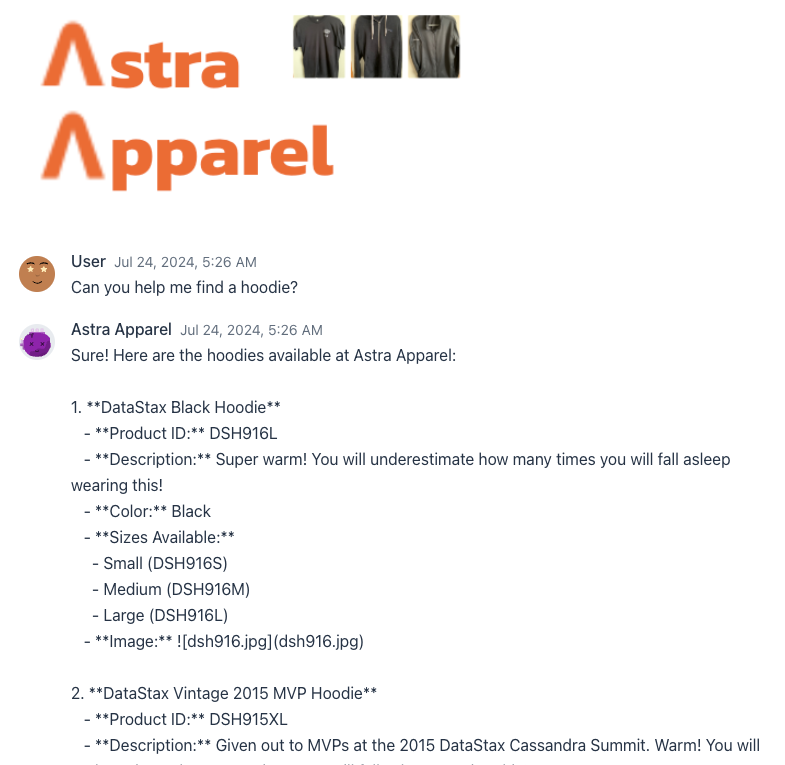

# Shopping Assistant GUI
Builds a web-based GUI using Java and Vaadin, which runs on top of a (local) installation of Langflow. It interacts with the chat flow submitting questions and returning responses via an underlying HTTP POST.

## Known issues
 - Menu resizes horizontally based on the contents.

## Requirements

 - Java 21 (JRE)
 - Environment variables
     - `ASTRA_LANGFLOW_URL`
     - `BEARER_TOKEN`
 - A vector database which supports the Cassandra binary protocol:
    - Astra DB
    - DSE 6.9
    - HCD 1.0
 - Product data CSV found in [data/products.csv](data/products.csv)

## Database Schema

This is automatically created.

## To build:

### Build Requirements

 - Maven

The [pom.xml](pom.xml) file can be adjusted to build with earlier versions of Java, but it is not recommended to go below 17.

### Build command

    mvn package -Pproduction

### Running the build

    java -jar target/shoppingassistant-0.0.1-SNAPSHOT.jar
